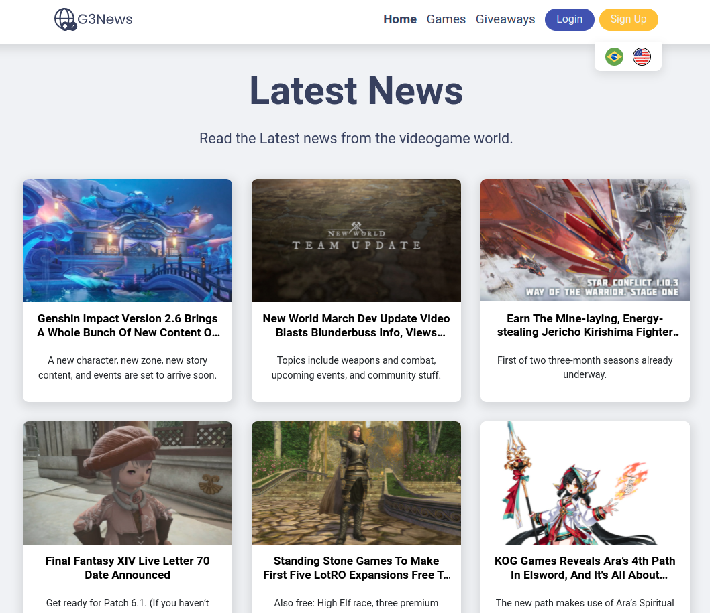
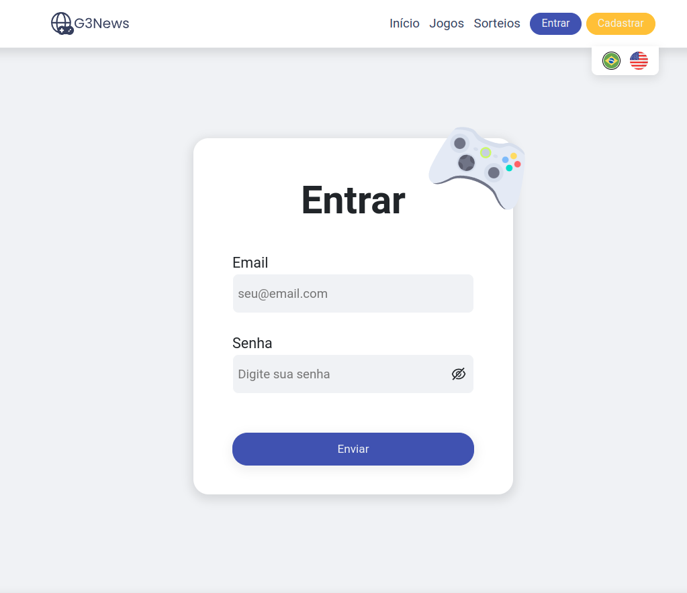
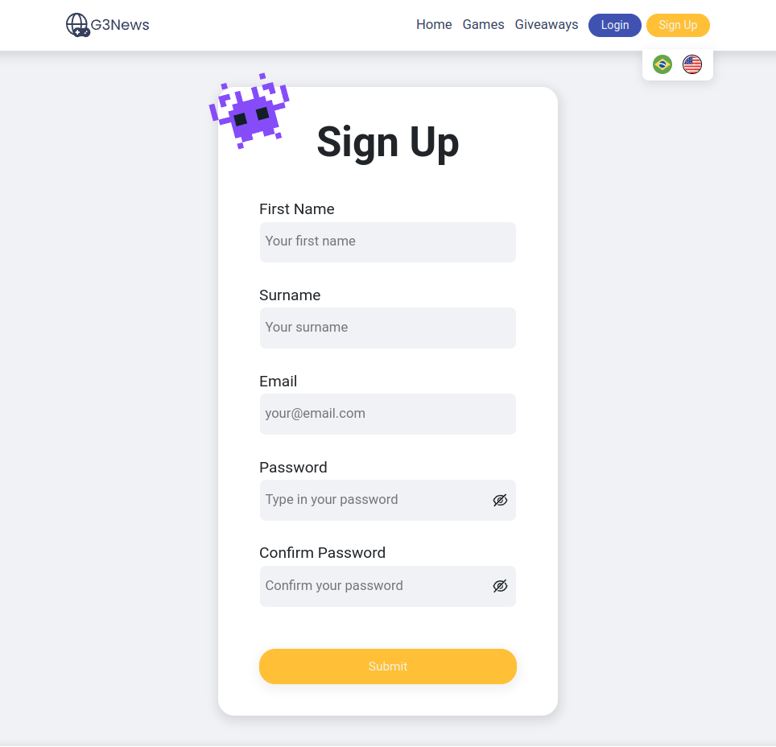
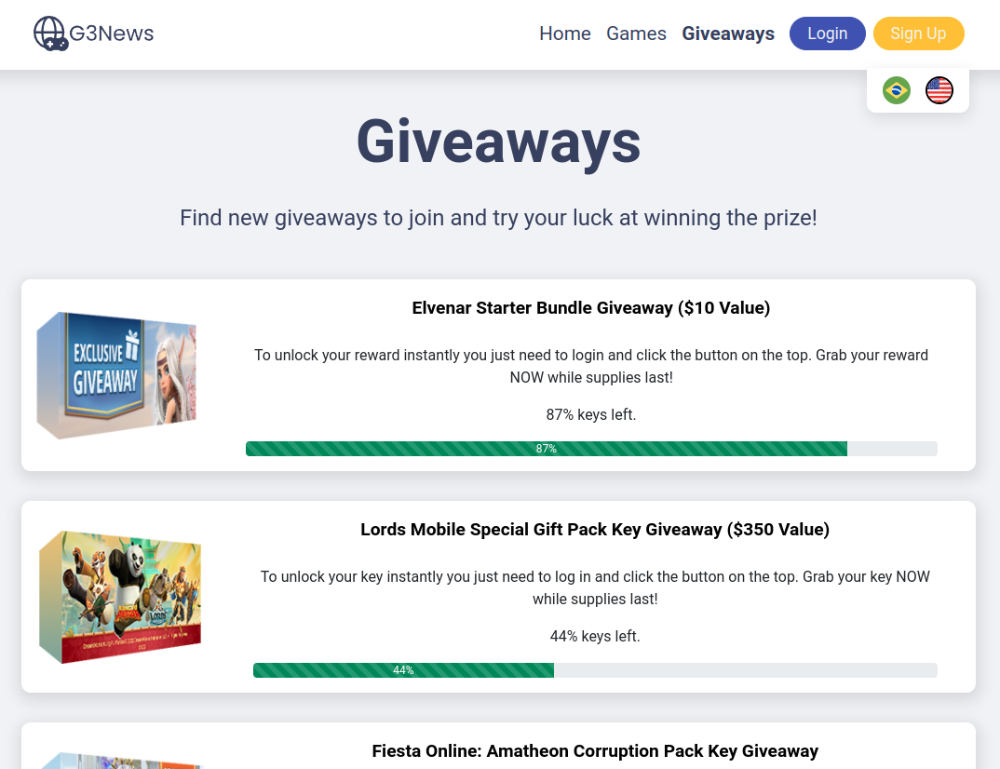
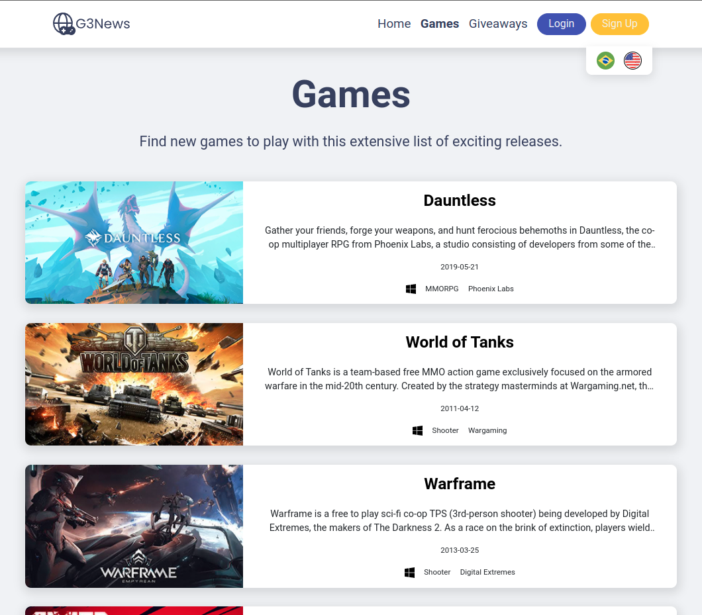
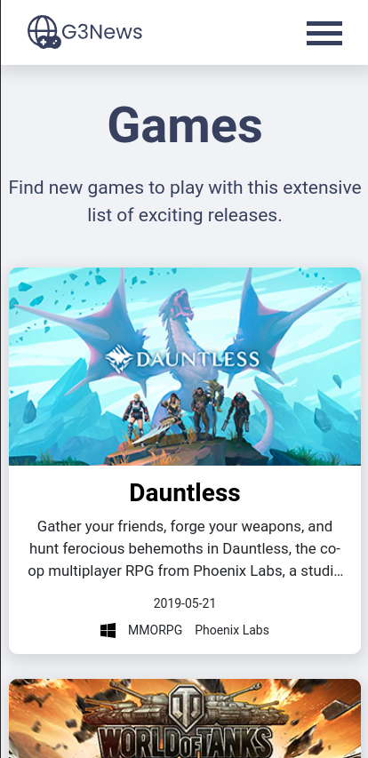
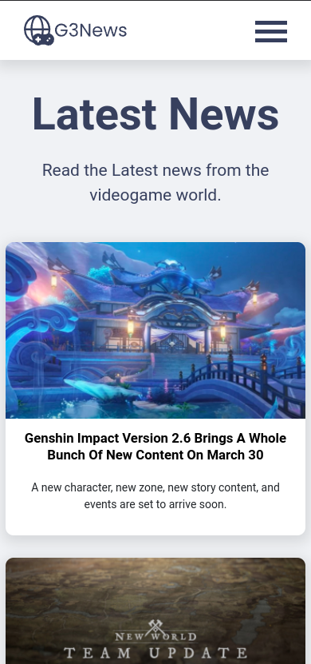

# </img> G3News

G3News is a gaming news app. It consumes the MMO Games API through Axios. 

Access on Heroku: https://g3news.herokuapp.com/

Login and Sign up are disabled on Heroku because JSON Server is not deployed there. However by cloning the project it is possible to use those functionalities.

## Installation

Clone the project:

```bash
git clone git@github.com:leojuriolli7/g3news.git
```

Go to the project directory:

```bash
cd g3news
```

Install the project dependencies:

```bash
npm install
```
## Usage

First, start JSON Server:

```bash
npm run json-server
```

Start the application:

```bash
npm start
```


## Technologies used:
- React Query to make POST requests to the database.
- React Redux Toolkit alongside Redux Persist to store the login information of the user, as to not log them out after a refresh.
- i18next for translation.
- Axios.
- Formik and Yup.
- Styled Components.
- React Router.
- React Lottie to display a loading animation while the API is still fetching the data. 
- React Hot Toast to display toast error messages. 
- Animate CSS to animate components. 

## Pages:

- <strong>Home:</strong> This page contains a list of the Latest News of the videogame world. When one is selected, it opens the link for the news article provided by the API.
- <strong>Games:</strong> This page has a list of games. Each game has a title, short description, an icon displaying it's platform, the publisher and release date. When a game is clicked it opens the link for the game's page provided by the API.
- <strong>Giveaways:</strong> This page displays a list of giveaways available to enter, complete with a progress bar. When a giveaway is clicked, it opens the link for it provided by the API.
- <strong>Sign up:</strong> This page allows the user to create a new account that will be stored on the local database using JSON Server. The forms were created with Formik and authentication was done with Yup and regex (names mustn't have numbers, password must have 5+ digits, password confirmation, etc.) 
- <strong>Login:</strong> This page allows the user to login with the account created. When logged, a profile page will now be available and reachable through a profile icon on the right-side of the header. It allows access to the profile page and to logout.
- <strong>Profile:</strong> This is the profile page, accessible through the profile icon on the header. It displays the profile image and name of the user.


As of right now it is not possible to store profile pictures on the JSON server, but there is a test account with a picture stored on imgur: 
- Email: testAccount@email.com
- Password: 12345

</img>
</img>
</img>
</img>
</img> <br>
</img>
</img>


